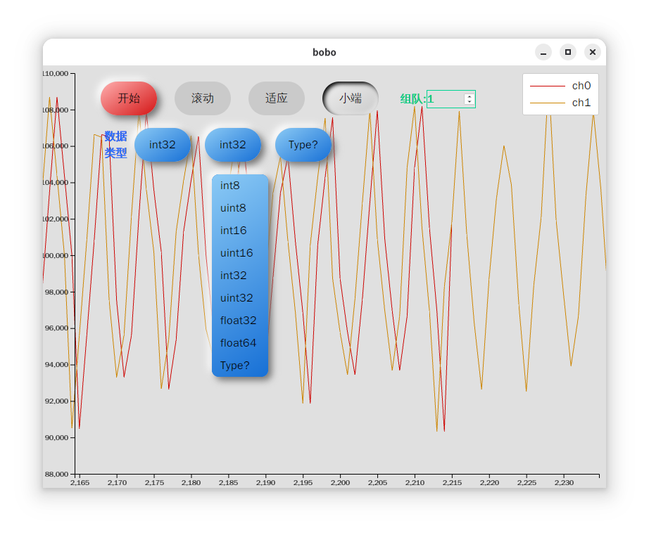

# bobo(波哦波)

一个从tcp接收数据并显示为波形的软件.



点击开始后在本地9333监听tcp连接.一个"0xfffffff00fffffff"被示为一个开始标记.标记应先发高位.多次发送只需要一个开始标记,也可在每次发送时发送标记.该标记用于对齐数据,以便正确解析数据类型.

## 发送标记示例
### 单片机代码

```c
uint32_t start[2]={0xfffffff0, 0x0fffffff};
uint32_t data[2]={0x00, 0xffff};
SEGGER_RTT_Write(1, start, 8);
  while(1)
  {
    SEGGER_RTT_Write(1, data, 8);
  }
```

### cortex-debug配置
```json
//.vscode/launch.json
{
  // 使用 IntelliSense 了解相关属性。
  // 悬停以查看现有属性的描述。
  // 欲了解更多信息，请访问: https://go.microsoft.com/fwlink/?linkid=830387
  "version": "0.2.0",
  "configurations": [
    {
      "name": "openocd-dap",
      "type": "cortex-debug",
      "request": "launch",
      "cwd": "${workspaceRoot}",
      "executable": "${workspaceRoot}/build/debug/AT32_Audio.elf",
      "servertype": "openocd",
      "interface": "swd",
      "svdFile": "${workspaceRoot}/AT32F435CMU7_WorkBench/project/AT32_IDE/SVD/AT32F435xx_v2.svd",
      "preLaunchTask": "build Debug", //先运行make任务
      // "searchDir": ["/home/${env:USER}/.openocd/scripts"],
      "serverpath": "/home/lei/at32-work-bench/OpenOCD_Linux_x86-64_V2.0.6/bin/openocd",
      "configFiles": ["openocd_dap.cfg"],
      "rttConfig": {
        "enabled": true,
        "address": "auto",
        // "clearSearch": false    // OpenOCD users may have to un-comment this
        "decoders": [
          {
            "port": 0,
            "type": "console"
          },
          {
            "port": 1,
            "type": "console"
          },
          {
            "port": 1,
            "type": "advanced",
            "decoder": "rtt_forward.js",
            "ports": [1]  // Specify which SWO ports to forward
        }
        ]
      }
    }
  ]
}

```

### cortex-debug的高级解码器示例

该解码器将rtt1通道数据转发到tcp9333端口
```js
var net = require('net');
function delay(ms) {
    return new Promise(resolve => setTimeout(resolve, ms));
}
// 创建一个 TCP 客户端
const HOST = '127.0.0.1'; // 目标服务器的 IP 地址
const PORT = 9333;       // 目标服务器的端口号
const client = new net.Socket();
let serverStatus = 0;
let dispose = false;
var avd = {};
let connectCallback;
avd.default = function () {
    connectCallback = () => {
        this.displayOutput(`已连接到服务器 ${HOST}:${PORT}\n`);
        serverStatus = 1;
        dispose = false;
    }
    this.init = function (config, displayOutput, graphData) {
        this.displayOutput = displayOutput;
        this.graphData = graphData;
        // 连接到服务器
        client.connect(PORT, HOST, connectCallback);
        // 监听数据接收事件
        client.on('data', (data) => {
            this.displayOutput(`收到服务器数据: ${data.toString()}\n`);
        });

        // 监听连接关闭事件
        client.on('close', () => {
            this.displayOutput('连接已关闭\n');
            serverStatus = 0;
            if (!dispose) {
                setTimeout(() => {
                    this.displayOutput('尝试重连服务器\n');
                    client.connect(PORT, HOST, () => {
                        this.displayOutput(`已重新连接到服务器 ${HOST}:${PORT}\n`);
                        serverStatus = 1;
                    });
                }, 3000);
            }

        });

        // 监听错误事件
        client.on('error', (err) => {
            this.displayOutput(`发生错误:${err}\n`);
            client.removeAllListeners('connect');
        });
    };
    this.lostSynchronization = function () {
        this.displayOutput('lostSynchronization\n');
    };
    this.synchronized = function () {
        this.displayOutput('synchronized\n');
    };
    this.softwareEvent = async function (port, data) {
        if (serverStatus) {
            client.write(data); // 发送数据
        }

    };
    this.typeName = function () {
        return "bobo"
    };
    this.outputLabel = function () {
        return 'bobo';
    };
    this.dispose = function () {
        client.destroy();
        dispose = true;
        serverStatus = 0;

        this.displayOutput('dispose');

    };
}
module.exports = avd;
```
